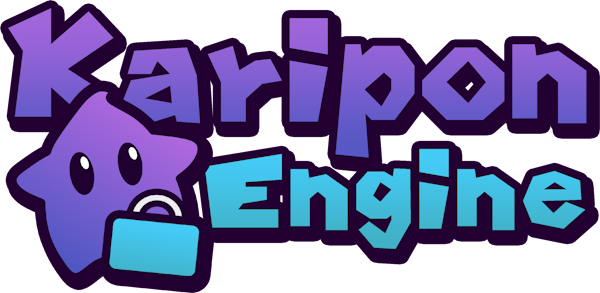

<h1 align="center">
   
  
</h1>

The **Karipon Engine** is a **Super Mario Galaxy** engine based on the [Petari](https://github.com/SMGCommunity/Petari) decompilation that adds multiple features to the original game.

### Dev Planning
- Multiplayer packet handling
  - Discardable (?) packet handling
    - Use cases: player states, object states, pings, etc. Any data that can be lost without issues
    - Use a global temporary packet buffer
    - Has an invalid global tracking packet ID (-1)
  - Reliable packet handling
    - Use cases: stage switches, chat messages, etc. Any data that must be sent to every single connected player.
    - One or multiple dedicated buffers for a specific packet type
    - Has a valid global tracking packet ID
    - Ensures packet IDs are synced between clients (with some kind of verification packet that resends the packet until every clients are either synced or disconnected)

### Dev TODOs
- Fix uses of MR::calcOpenedAstroDomeNum
- NAND dummy mode build flag (__OSStartPlayRecord, save files, etc.) so I can boot up two instances of the game at once
